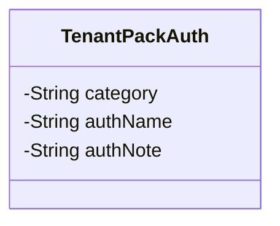
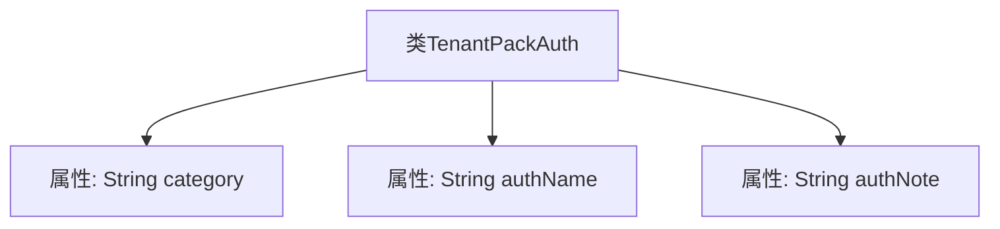

# 基础信息

|      |      |
|------|------|
| 名称 | TenantPackAuth |
| 编码语言 | .java |
| 代码路径 | JeecgBoot/jeecg-boot/jeecg-module-system/jeecg-system-biz/src/main/java/org/jeecg/modules/system/vo/tenant/TenantPackAuth.java |
| 包名 | org.jeecg.modules.system.vo.tenant |
| 依赖项 | ['lombok.Data'] |
| 概述说明 | TenantPackAuth类包含一级菜单、权限菜单名称和描述。 |

# 说明

TenantPackAuth类主要包含三个关键信息：一级菜单、权限菜单名称和描述。一级菜单用于标识系统中的主要功能模块，权限菜单名称则具体定义了用户可操作的菜单项，描述部分提供了对权限菜单的详细说明，帮助用户理解其功能和作用。

# 类列表 Class Summary

| 名称   | 类型  | 说明 |
|-------|------|-------------|
| TenantPackAuth | class | TenantPackAuth类包含一级菜单、权限菜单名称和描述。 |

## 类 TenantPackAuth

|      |      |
|------|------|
| 访问范围 | @Data;public |
| 类型 | class |
| 名称 | TenantPackAuth |
| 说明 | TenantPackAuth类包含一级菜单、权限菜单名称和描述。 |

### UML类图

这段代码定义了一个名为 `TenantPackAuth` 的类，该类包含了三个私有成员变量：`category`、`authName` 和 `authNote`，分别表示一级菜单、权限菜单名称和权限菜单描述。该类没有定义任何方法，仅用于存储与租户权限相关的数据。这种结构通常用于数据封装，便于在应用程序中传递和管理权限信息。

### 内部方法调用关系图

这段代码定义了一个名为`TenantPackAuth`的类，该类包含三个私有属性：`category`（一级菜单）、`authName`（权限菜单名称）和`authNote`（权限菜单描述）。这些属性用于存储与权限菜单相关的信息。代码使用了Lombok库的`@Data`注解，自动生成了getter、setter、toString等方法，简化了代码的编写。

### 字段列表 Field List

| 名称  | 类型  | 说明 |
|-------|-------|------|
| category | String | 定义了一个私有字符串变量category。 |
| authNote | String | 私有字符串变量authNote用于存储认证备注信息。 |
| authName | String | 定义一个私有的字符串变量authName。 |

### 方法列表 Method List

| 名称  | 类型  | 说明 |
|-------|-------|------|

