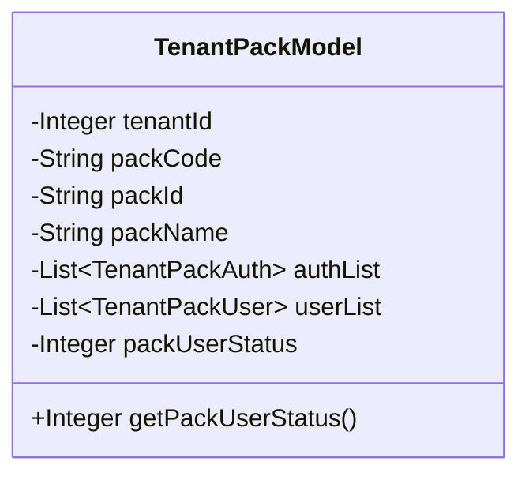
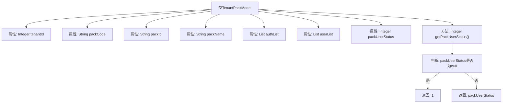

# 基础信息

|      |      |
|------|------|
| 名称 | TenantPackModel |
| 编码语言 | .java |
| 代码路径 | JeecgBoot/jeecg-boot/jeecg-module-system/jeecg-system-biz/src/main/java/org/jeecg/modules/system/vo/tenant/TenantPackModel.java |
| 包名 | org.jeecg.modules.system.vo.tenant |
| 依赖项 | ['lombok.Data', 'java.util.List'] |
| 概述说明 | 租户产品包模型含租户ID、产品包编码、ID、名称、权限、用户列表及状态。 |

# 说明

租户产品包模型主要包含以下关键信息：租户ID用于标识特定租户，产品包编码用于唯一标识产品包，ID用于内部识别，名称描述产品包的名称，权限信息定义产品包的访问权限，用户列表列出使用该产品包的用户，状态表示产品包的当前状态。这些信息共同构成了租户产品包的完整模型，确保了对产品包的管理和使用的全面控制。

# 类列表 Class Summary

| 名称   | 类型  | 说明 |
|-------|------|-------------|
| TenantPackModel | class | 租户产品包模型包含租户ID、产品包编码、ID、名称、权限信息、用户列表及状态。 |

## 类 TenantPackModel

|      |      |
|------|------|
| 访问范围 | @Data;public |
| 类型 | class |
| 名称 | TenantPackModel |
| 说明 | 租户产品包模型包含租户ID、产品包编码、ID、名称、权限信息、用户列表及状态。 |

### UML类图

这段代码定义了一个名为 `TenantPackModel` 的类，用于表示租户产品包的相关信息。类中包含多个私有属性，如租户ID (`tenantId`)、产品包编码 (`packCode`)、产品包ID (`packId`)、产品包名称 (`packName`)、权限信息列表 (`authList`)、用户列表 (`userList`) 和状态 (`packUserStatus`)。类中还定义了一个公有方法 `getPackUserStatus()`，用于获取产品包状态，如果状态为 `null`，则默认返回 `1`。该类主要用于管理租户产品包的相关数据和状态。

### 内部方法调用关系图

这段代码定义了一个名为 `TenantPackModel` 的类，该类包含了多个属性，如 `tenantId`、`packCode`、`packId`、`packName`、`authList`、`userList` 和 `packUserStatus`。其中，`getPackUserStatus` 方法用于获取 `packUserStatus` 的值，如果该值为 `null`，则返回默认值 `1`，否则返回 `packUserStatus` 的实际值。流程图展示了类的结构以及 `getPackUserStatus` 方法的逻辑流程。

### 字段列表 Field List

| 名称  | 类型  | 说明 |
|-------|-------|------|
| packName | String | 定义私有字符串变量packName。 |
| userList | List<TenantPackUser> | 私有用户列表存储租户包用户信息。 |
| packCode | String | 定义了一个私有字符串变量packCode。 |
| packId | String | 定义私有字符串变量packId。 |
| tenantId | Integer | 私有整型变量tenantId，用于存储租户ID。 |
| authList | List<TenantPackAuth> | 私有租户权限列表变量authList。 |
| packUserStatus | Integer | 私有整型变量packUserStatus用于存储用户状态。 |

### 方法列表 Method List

| 名称  | 类型  | 说明 |
|-------|-------|------|
| getPackUserStatus | Integer | 获取用户状态，若为空则返回默认值1。 |

