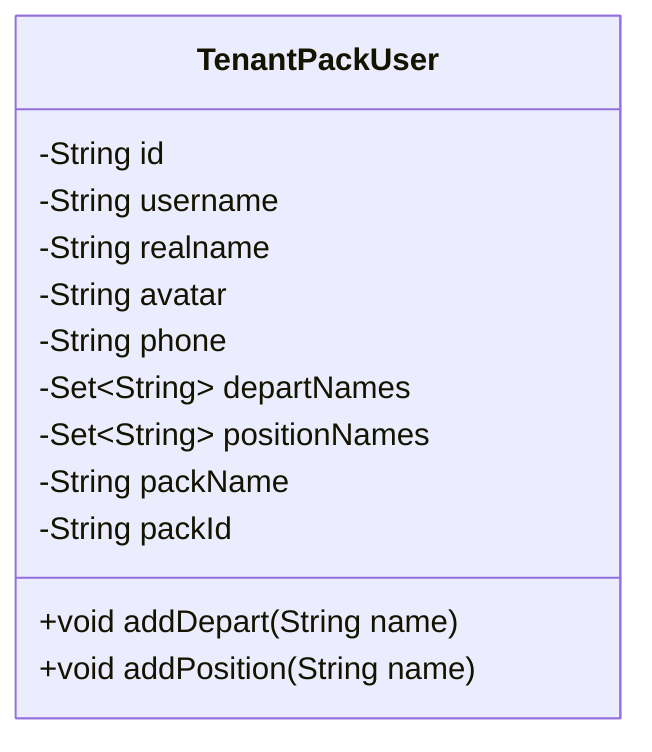
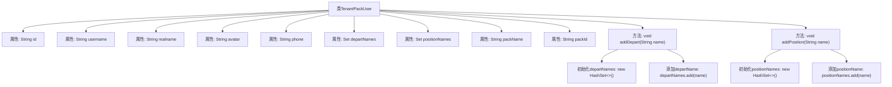

# 基础信息

|      |      |
|------|------|
| 名称 | TenantPackUser |
| 编码语言 | .java |
| 代码路径 | JeecgBoot/jeecg-boot/jeecg-module-system/jeecg-system-biz/src/main/java/org/jeecg/modules/system/vo/tenant/TenantPackUser.java |
| 包名 | org.jeecg.modules.system.vo.tenant |
| 依赖项 | ['lombok.Data', 'java.util.HashSet', 'java.util.Set'] |
| 概述说明 | TenantPackUser类包含用户信息及部门职位，支持添加。 |

# 说明

TenantPackUser类用于存储用户的基本信息，包括用户ID、用户名、真实姓名、头像和电话。此外，该类还包含用户的部门集合和职位集合，支持动态添加部门和职位。同时，该类还记录了用户所属的租户产品包名称和ID，便于管理和识别用户在不同租户产品包中的角色和权限。

# 类列表 Class Summary

| 名称   | 类型  | 说明 |
|-------|------|-------------|
| TenantPackUser | class | TenantPackUser类包含用户ID、用户名、真实姓名、头像、电话、部门集合、职位集合、租户产品包名称和ID，支持添加部门和职位。 |

## 类 TenantPackUser

|      |      |
|------|------|
| 访问范围 | @Data;public |
| 类型 | class |
| 名称 | TenantPackUser |
| 说明 | TenantPackUser类包含用户ID、用户名、真实姓名、头像、电话、部门集合、职位集合、租户产品包名称和ID，支持添加部门和职位。 |

### UML类图

**描述：**  
`TenantPackUser` 类用于表示租户产品包中的用户信息。该类包含用户的基本信息，如 `id`、`username`、`realname`、`avatar` 和 `phone`，还包含用户所属的部门名称集合 `departNames` 和职位名称集合 `positionNames`，以及租户产品包的名称 `packName` 和 ID `packId`。类中提供了 `addDepart` 和 `addPosition` 方法，用于动态添加部门和职位名称到相应的集合中。

### 内部方法调用关系图

这段代码定义了一个名为`TenantPackUser`的类，包含了多个属性，如用户ID、用户名、真实姓名、头像、电话等。类中还包含两个方法`addDepart`和`addPosition`，分别用于向`departNames`和`positionNames`集合中添加部门名称和职位名称。如果集合为空，方法会先初始化集合再进行添加操作。流程图展示了类的属性和方法之间的调用关系。

### 字段列表 Field List

| 名称  | 类型  | 说明 |
|-------|-------|------|
| id | String | 定义了一个私有字符串类型的变量id。 |
| packId | String | 定义私有字符串变量packId。 |
| departNames | Set<String> | 包含部门名称的私有字符串集合。 |
| avatar | String | 定义私有字符串变量avatar。 |
| phone | String | 定义私有字符串变量phone。 |
| username | String | 定义私有字符串类型变量username。 |
| packName | String | 私有字符串变量packName声明。 |
| realname | String | 声明一个私有的字符串类型变量realname。 |
| positionNames | Set<String> | 私有集合存储职位名称字符串。 |

### 方法列表 Method List

| 名称  | 类型  | 说明 |
|-------|-------|------|
| addPosition | void | 方法`addPosition`用于向集合`positionNames`中添加职位名称。 |
| addDepart | void | 定义一个方法，用于向集合departNames添加部门名称。 |

