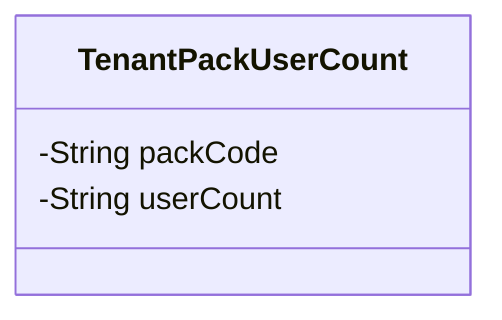
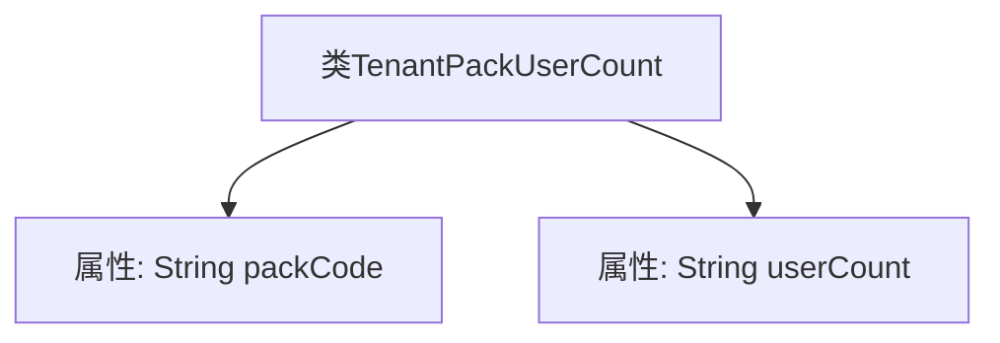

# 基础信息

|      |      |
|------|------|
| 名称 | TenantPackUserCount |
| 编码语言 | .java |
| 代码路径 | JeecgBoot/jeecg-boot/jeecg-module-system/jeecg-system-biz/src/main/java/org/jeecg/modules/system/vo/tenant/TenantPackUserCount.java |
| 包名 | org.jeecg.modules.system.vo.tenant |
| 依赖项 | ['lombok.Data'] |
| 概述说明 | 租户产品包编码与用户数量数据类。 |

# 说明

该数据类主要用于存储租户产品包编码和用户数量的相关信息。它包含两个关键字段：租户产品包编码，用于唯一标识每个租户的产品包；用户数量，用于记录当前使用该产品包的用户总数。该数据类设计简洁，便于在系统中高效管理和查询租户产品包的使用情况，确保数据的准确性和一致性。

# 类列表 Class Summary

| 名称   | 类型  | 说明 |
|-------|------|-------------|
| TenantPackUserCount | class | 租户产品包编码和用户数量的数据类。 |

## 类 TenantPackUserCount

|      |      |
|------|------|
| 访问范围 | @Data;public |
| 类型 | class |
| 名称 | TenantPackUserCount |
| 说明 | 租户产品包编码和用户数量的数据类。 |

### UML类图

类图描述：`TenantPackUserCount` 类用于表示租户产品包的用户数量信息，包含两个私有属性：`packCode`（租户产品包编码）和 `userCount`（用户数量）。该类没有定义公有方法，仅用于数据存储。

### 内部方法调用关系图

这段代码定义了一个名为 `TenantPackUserCount` 的类，该类包含两个属性：`packCode` 和 `userCount`，分别表示租户产品包编码和用户数量。代码使用了 Lombok 的 `@Data` 注解，自动生成了 getter、setter、toString、equals 和 hashCode 方法，简化了代码的编写。流程图展示了类与其属性之间的关系，清晰地反映了类的结构。

### 字段列表 Field List

| 名称  | 类型  | 说明 |
|-------|-------|------|
| packCode | String | 定义私有字符串变量packCode。 |
| userCount | String | 代码定义了一个私有字符串变量userCount。 |

### 方法列表 Method List

| 名称  | 类型  | 说明 |
|-------|-------|------|

