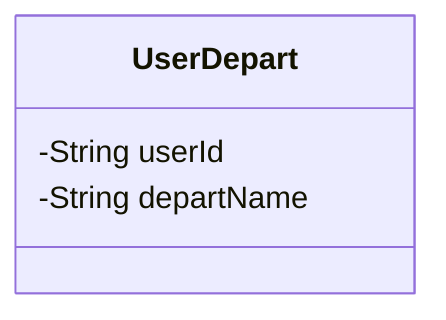
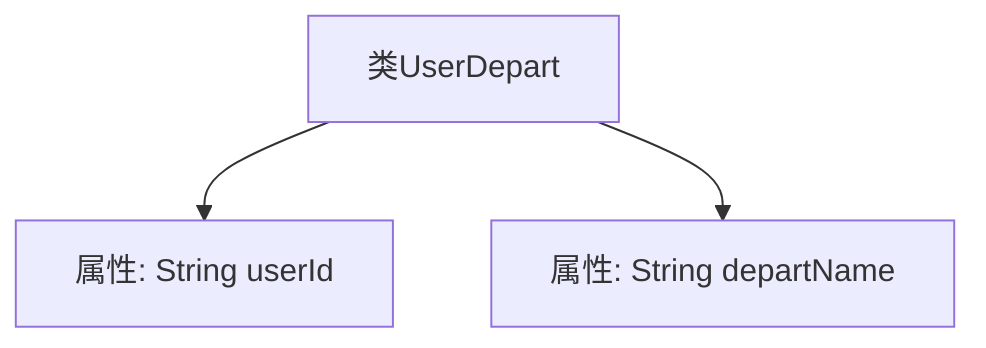

# 基础信息

|      |      |
|------|------|
| 名称 | UserDepart |
| 编码语言 | .java |
| 代码路径 | JeecgBoot/jeecg-boot/jeecg-module-system/jeecg-system-biz/src/main/java/org/jeecg/modules/system/vo/tenant/UserDepart.java |
| 包名 | org.jeecg.modules.system.vo.tenant |
| 依赖项 | ['lombok.Data'] |
| 概述说明 | 用户部门类含用户ID和部门名称两个属性。 |

# 说明

用户部门类定义了两个主要属性：用户ID和部门名称。用户ID用于唯一标识每个用户，而部门名称则用于标识用户所属的部门。这两个属性共同构成了用户部门类的基本结构，便于在系统中管理和查询用户及其所属部门的信息。

# 类列表 Class Summary

| 名称   | 类型  | 说明 |
|-------|------|-------------|
| UserDepart | class | 用户部门类包含用户ID和部门名称两个属性。 |

## 类 UserDepart

|      |      |
|------|------|
| 访问范围 | @Data;public |
| 类型 | class |
| 名称 | UserDepart |
| 说明 | 用户部门类包含用户ID和部门名称两个属性。 |

### UML类图

这段代码定义了一个名为 `UserDepart` 的类，该类包含两个私有属性：`userId` 和 `departName`。`userId` 用于存储用户的唯一标识符，`departName` 用于存储用户所属部门的名称。由于使用了 `@Data` 注解，该类会自动生成 `getter`、`setter`、`equals`、`hashCode` 和 `toString` 方法，尽管这些方法在代码中没有显式定义。

### 内部方法调用关系图

这段代码定义了一个名为 `UserDepart` 的类，该类包含两个私有属性：`userId` 和 `departName`。`userId` 用于存储用户的唯一标识符，而 `departName` 用于存储用户所属部门的名称。代码结构简单，主要用于封装用户与部门的基本信息，以便在程序中方便地管理和访问这些数据。

### 字段列表 Field List

| 名称  | 类型  | 说明 |
|-------|-------|------|
| userId | String | 定义了一个私有字符串类型的变量userId。 |
| departName | String | 私有字符串变量departName。 |

### 方法列表 Method List

| 名称  | 类型  | 说明 |
|-------|-------|------|

