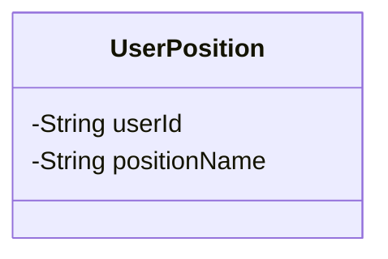
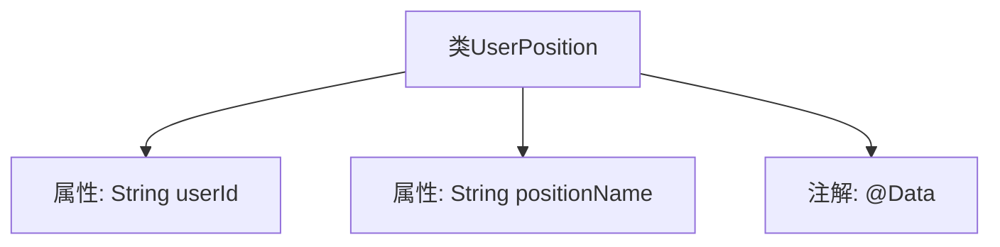

# 基础信息

|      |      |
|------|------|
| 名称 | UserPosition |
| 编码语言 | .java |
| 代码路径 | JeecgBoot/jeecg-boot/jeecg-module-system/jeecg-system-biz/src/main/java/org/jeecg/modules/system/vo/tenant/UserPosition.java |
| 包名 | org.jeecg.modules.system.vo.tenant |
| 依赖项 | ['lombok.Data'] |
| 概述说明 | 用户位置类含用户ID和职位名称两个属性。 |

# 说明

用户位置类是一个数据结构，用于存储与用户相关的特定信息。该类包含两个关键属性：用户ID和职位名称。用户ID用于唯一标识每个用户，而职位名称则描述该用户在组织或系统中的具体职位。这两个属性共同构成了用户位置类的核心内容，确保能够准确记录和区分不同用户及其对应的职位信息。

# 类列表 Class Summary

| 名称   | 类型  | 说明 |
|-------|------|-------------|
| UserPosition | class | 用户位置类包含用户ID和职位名称两个属性。 |

## 类 UserPosition

|      |      |
|------|------|
| 访问范围 | @Data;public |
| 类型 | class |
| 名称 | UserPosition |
| 说明 | 用户位置类包含用户ID和职位名称两个属性。 |

### UML类图

这段代码定义了一个名为 `UserPosition` 的类，该类包含两个私有属性：`userId` 和 `positionName`。`userId` 用于存储用户的唯一标识符，而 `positionName` 用于存储用户的职位名称。该类使用了 `@Data` 注解，通常用于自动生成 `getter`、`setter`、`toString`、`equals` 和 `hashCode` 方法，从而简化代码。通过这个类，可以方便地管理和操作用户的职位信息。

### 内部方法调用关系图

这段代码定义了一个名为 `UserPosition` 的类，该类包含两个属性：`userId` 和 `positionName`，分别用于存储用户ID和职位名称。类上使用了 `@Data` 注解，该注解通常用于自动生成getter、setter、toString等方法，从而简化代码。流程图展示了类的基本结构及其属性与注解之间的关系。

### 字段列表 Field List

| 名称  | 类型  | 说明 |
|-------|-------|------|
| userId | String | 定义私有字符串变量userId。 |
| positionName | String | 变量positionName用于存储职位名称。 |

### 方法列表 Method List

| 名称  | 类型  | 说明 |
|-------|-------|------|

