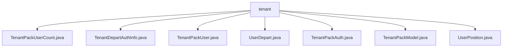

# 基础信息

|      |      |
|------|------|
| 名称 | tenant |
| 编码语言 | .java |
| 代码路径 | JeecgBoot/jeecg-boot/jeecg-module-system/jeecg-system-biz/src/main/java/org/jeecg/modules/system/vo/tenant |
| 包名 | JeecgBoot.jeecg-boot.jeecg-module-system.jeecg-system-biz.src.main.java.org.jeecg.modules.system.vo.tenant |
| 概述说明 | 多个数据类用于管理系统中的租户、用户、部门、职位及权限信息。 |

# 说明

## 概述
该代码模块主要用于管理和维护租户产品包及其相关用户信息。模块包含多个数据类，分别用于存储租户产品包的编码、用户数量、用户基本信息、部门信息、权限信息以及产品包的详细配置。这些类共同构成了一个完整的租户产品包管理系统，确保了对租户、用户、权限和资源的有效管理和查询。

## 主要业务场景
1. **租户产品包管理**：通过`TenantPackModel`类，系统能够管理租户的产品包信息，包括产品包编码、名称、权限信息、用户列表和状态等。`TenantPackUserCount`类用于记录和查询租户产品包的用户数量，确保产品包使用情况的准确性。

2. **用户权限管理**：`TenantDepartAuthInfo`类用于管理租户的权限配置，包括超级管理员状态、租户信息、产品包人员数量和产品包编码。`TenantPackAuth`类则定义了权限菜单的详细信息，帮助用户理解和操作系统的功能模块。

3. **用户信息管理**：`TenantPackUser`类用于存储用户的基本信息，包括用户ID、用户名、真实姓名、头像、电话等，并支持动态添加部门和职位信息。`UserDepart`和`UserPosition`类分别用于管理用户的部门信息和职位信息，确保用户与其所属部门和职位的准确关联。

4. **租户资源配置**：通过`TenantPackModel`和`TenantDepartAuthInfo`类，系统能够配置和管理租户的资源，包括产品包的用户数量、权限菜单等，确保租户在使用系统时的资源分配合理且高效。

### 包内部结构视图

该流程图展示了`tenant`文件夹与其包含的多个Java文件之间的层级关系。`tenant`作为父节点，直接连接了多个子节点，每个子节点代表一个具体的Java文件，文件名称清晰地反映了其功能或内容。这种结构有助于快速理解文件组织方式，便于开发和维护。

# 文件列表 File List

| 名称   | 类型  | 说明 |
|-------|------|-------------|
| [TenantPackAuth.java](TenantPackAuth.md) | file | TenantPackAuth类包含一级菜单、权限菜单名称和描述。 |
| [TenantDepartAuthInfo.java](TenantDepartAuthInfo.md) | file | 类TenantDepartAuthInfo包含超级管理员状态、租户信息、产品包人员数量及产品包编码。 |
| [UserPosition.java](UserPosition.md) | file | 用户位置类含用户ID和职位名称两个属性。 |
| [TenantPackModel.java](TenantPackModel.md) | file | 租户产品包模型含租户ID、产品包编码、ID、名称、权限、用户列表及状态。 |
| [UserDepart.java](UserDepart.md) | file | 用户部门类含用户ID和部门名称两个属性。 |
| [TenantPackUser.java](TenantPackUser.md) | file | TenantPackUser类包含用户信息及部门职位，支持添加。 |
| [TenantPackUserCount.java](TenantPackUserCount.md) | file | 租户产品包编码与用户数量数据类。 |

