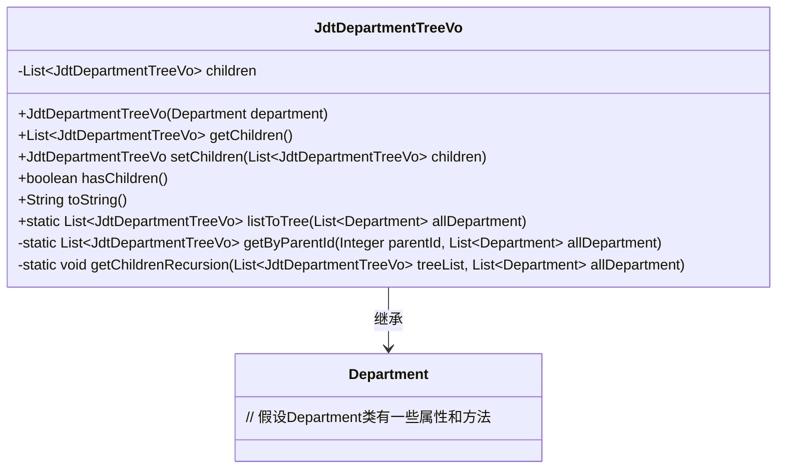
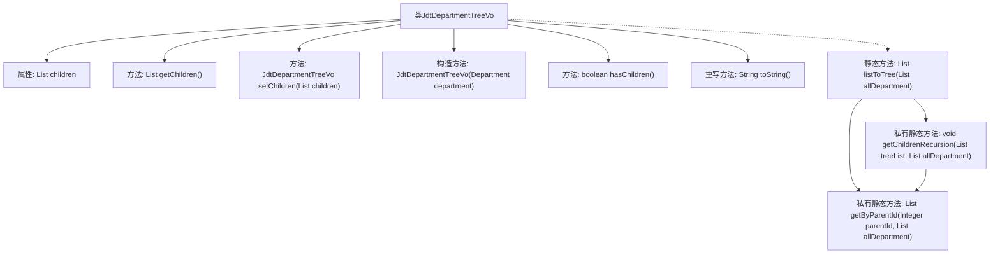

# 基础信息

|      |      |
|------|------|
| 名称 | JdtDepartmentTreeVo |
| 编码语言 | .java |
| 代码路径 | JeecgBoot/jeecg-boot/jeecg-module-system/jeecg-system-biz/src/main/java/org/jeecg/modules/system/vo/thirdapp/JdtDepartmentTreeVo.java |
| 包名 | org.jeecg.modules.system.vo.thirdapp |
| 依赖项 | ['com.jeecg.dingtalk.api.department.vo.Department', 'org.springframework.beans.BeanUtils', 'java.util.ArrayList', 'java.util.List', 'java.util.Optional'] |
| 概述说明 | JdtDepartmentTreeVo类继承Department，含子部门列表及递归建树方法。 |

# 说明

JdtDepartmentTreeVo类继承自Department类，主要用于表示部门树结构。该类包含一个子部门列表，用于存储当前部门的所有子部门。此外，该类还提供了一个递归方法，用于构建整个部门树结构。通过递归调用，该方法能够逐层遍历并组织所有子部门，形成一个完整的树形结构，便于管理和展示部门层级关系。

# 类列表 Class Summary

| 名称   | 类型  | 说明 |
|-------|------|-------------|
| JdtDepartmentTreeVo | class | JdtDepartmentTreeVo类扩展Department，包含子部门列表及递归构建树结构方法。 |

## 类 JdtDepartmentTreeVo

|      |      |
|------|------|
| 访问范围 | public |
| 类型 | class |
| 名称 | JdtDepartmentTreeVo |
| 说明 | JdtDepartmentTreeVo类扩展Department，包含子部门列表及递归构建树结构方法。 |

### UML类图

这段代码定义了一个`JdtDepartmentTreeVo`类，它继承自`Department`类，并用于表示部门树结构。`JdtDepartmentTreeVo`类包含一个子部门列表`children`，并提供了一些方法来操作这个列表，如获取子部门、设置子部门、判断是否有子部门等。此外，该类还提供了一个静态方法`listToTree`，用于将部门列表转换为树形结构。这个类的主要作用是将扁平的部门列表组织成树形结构，便于展示和操作。

### 内部方法调用关系图

这段代码定义了一个`JdtDepartmentTreeVo`类，用于表示部门树结构。该类继承自`Department`类，包含一个子部门列表`children`，并提供了获取和设置子部门的方法。`listToTree`方法将部门列表转换为树形结构，通过递归方式查找并设置子部门。`getByParentId`方法根据父部门ID获取子部门列表，`getChildrenRecursion`方法递归设置子部门。该代码主要用于处理部门数据的树形结构转换和递归操作。

### 字段列表 Field List

| 名称  | 类型  | 说明 |
|-------|-------|------|
| children | List<JdtDepartmentTreeVo> | 私有列表存储JdtDepartmentTreeVo子节点。 |

### 方法列表 Method List

| 名称  | 类型  | 说明 |
|-------|-------|------|
| getByParentId | List<JdtDepartmentTreeVo> | 通过父ID获取部门树结构列表。 |
| getChildren | List<JdtDepartmentTreeVo> | 获取子部门树列表的方法。 |
| hasChildren | boolean | 判断是否有子节点，返回布尔值。 |
| listToTree | List<JdtDepartmentTreeVo> | 将部门列表转换为树结构，包含顶层部门及其子部门。 |
| getChildrenRecursion | void | 递归方法遍历部门树，设置子节点并继续递归。 |
| toString | String | 重写toString方法，返回包含子节点信息的JwDepartmentTree字符串。 |
| setChildren | JdtDepartmentTreeVo | 方法设置子节点并返回当前对象。 |

