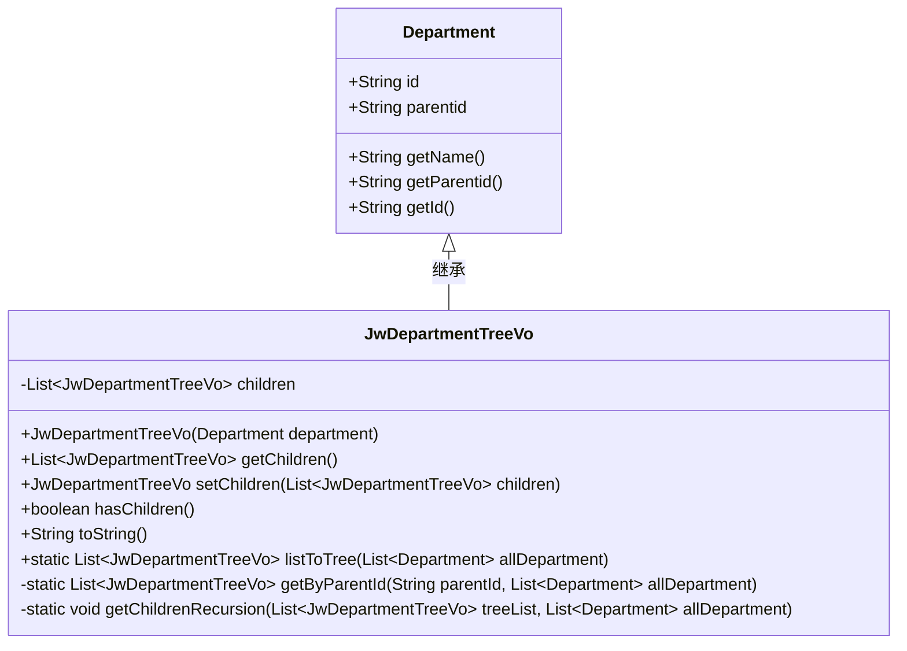
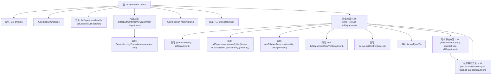

# 基础信息

|      |      |
|------|------|
| 名称 | JwDepartmentTreeVo |
| 编码语言 | .java |
| 代码路径 | JeecgBoot/jeecg-boot/jeecg-module-system/jeecg-system-biz/src/main/java/org/jeecg/modules/system/vo/thirdapp/JwDepartmentTreeVo.java |
| 包名 | org.jeecg.modules.system.vo.thirdapp |
| 依赖项 | ['com.jeecg.qywx.api.department.vo.Department', 'org.springframework.beans.BeanUtils', 'java.util.ArrayList', 'java.util.List', 'java.util.Optional'] |
| 概述说明 | JwDepartmentTreeVo继承Department，含子节点列表，支持树结构和递归获取子节点。 |

# 说明

JwDepartmentTreeVo类继承自Department类，主要用于表示部门树结构。该类包含一个子节点列表，支持将部门数据转换为树形结构，并能通过递归方法获取所有子节点。这一设计使得部门层次关系的管理和查询更加高效和灵活。

# 类列表 Class Summary

| 名称   | 类型  | 说明 |
|-------|------|-------------|
| JwDepartmentTreeVo | class | JwDepartmentTreeVo类继承Department，包含子节点列表，支持树结构转换和递归获取子节点。 |

## 类 JwDepartmentTreeVo

|      |      |
|------|------|
| 访问范围 | public |
| 类型 | class |
| 名称 | JwDepartmentTreeVo |
| 说明 | JwDepartmentTreeVo类继承Department，包含子节点列表，支持树结构转换和递归获取子节点。 |

### UML类图

**描述：**
`JwDepartmentTreeVo` 类继承自 `Department` 类，用于表示部门树结构。它包含一个子部门列表 `children`，并提供了获取和设置子部门的方法。此外，`JwDepartmentTreeVo` 还提供了判断是否有子部门的方法 `hasChildren`，以及将部门列表转换为树结构的静态方法 `listToTree`。该类通过递归方法 `getChildrenRecursion` 来构建树结构，确保每个部门的子部门都能被正确嵌套。

### 内部方法调用关系图

**描述：**
该流程图展示了`JwDepartmentTreeVo`类的结构和主要方法调用关系。`JwDepartmentTreeVo`类继承自`Department`类，包含一个`children`属性和多个方法，用于处理部门树结构。`listToTree`方法通过调用`getByParentId`和`getChildrenRecursion`方法，将部门列表转换为树形结构。`getChildrenRecursion`方法递归地寻找并设置子部门，最终构建完整的部门树。

### 字段列表 Field List

| 名称  | 类型  | 说明 |
|-------|-------|------|
| children | List<JwDepartmentTreeVo> | 私有变量children存储JwDepartmentTreeVo类型的列表。 |

### 方法列表 Method List

| 名称  | 类型  | 说明 |
|-------|-------|------|
| hasChildren | boolean | 检查是否存在子节点。 |
| setChildren | JwDepartmentTreeVo | 设置子部门列表并返回当前对象。 |
| getChildrenRecursion | void | 递归遍历部门树，查找并设置子级部门。 |
| getByParentId | List<JwDepartmentTreeVo> | 通过父ID筛选部门并生成树形结构列表。 |
| listToTree | List<JwDepartmentTreeVo> | 将部门列表转换为树形结构，包含顶层部门及其子部门。 |
| getChildren | List<JwDepartmentTreeVo> | 获取子部门列表的方法。 |
| toString | String | 重写toString方法，返回包含子节点的部门树信息。 |

