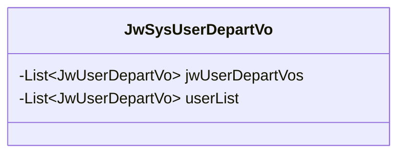
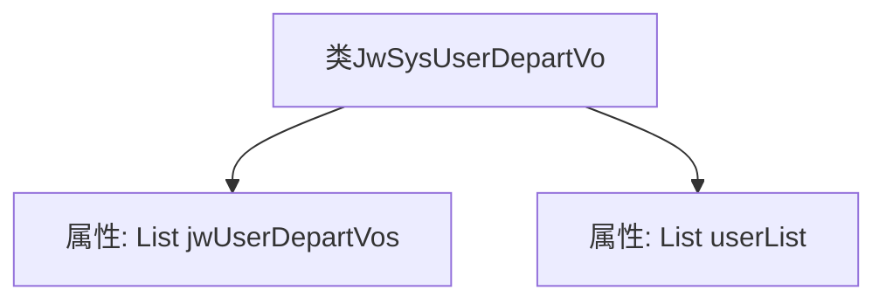

# 基础信息

|      |      |
|------|------|
| 名称 | JwSysUserDepartVo |
| 编码语言 | .java |
| 代码路径 | JeecgBoot/jeecg-boot/jeecg-module-system/jeecg-system-biz/src/main/java/org/jeecg/modules/system/vo/thirdapp/JwSysUserDepartVo.java |
| 包名 | org.jeecg.modules.system.vo.thirdapp |
| 依赖项 | ['lombok.Data', 'java.util.List'] |
| 概述说明 | 企业微信用户映射类，包含用户列表及映射关系。 |

# 说明

企业微信用户映射类主要用于管理用户列表及其之间的映射关系。该类包含两个核心部分：用户列表和映射关系。用户列表用于存储所有相关用户的信息，而映射关系则定义了这些用户之间的关联或对应关系。通过这种结构，可以有效地管理和查询用户之间的特定联系，适用于需要处理多用户关联的场景。

# 类列表 Class Summary

| 名称   | 类型  | 说明 |
|-------|------|-------------|
| JwSysUserDepartVo | class | 企业微信用户映射类，包含用户列表和映射关系。 |

## 类 JwSysUserDepartVo

|      |      |
|------|------|
| 访问范围 | @Data;public |
| 类型 | class |
| 名称 | JwSysUserDepartVo |
| 说明 | 企业微信用户映射类，包含用户列表和映射关系。 |

### UML类图

这段代码定义了一个名为 `JwSysUserDepartVo` 的类，该类包含两个私有成员变量：`jwUserDepartVos` 和 `userList`，它们都是 `JwUserDepartVo` 类型的列表。该类主要用于存储企业微信和用户的映射关系以及用户列表。通过 `@Data` 注解，可以自动生成 getter 和 setter 方法，简化了代码的编写。

### 内部方法调用关系图

这段代码定义了一个名为 `JwSysUserDepartVo` 的类，该类包含两个属性：`jwUserDepartVos` 和 `userList`，它们都是 `List<JwUserDepartVo>` 类型的列表。`jwUserDepartVos` 用于存储企业微信和用户的映射关系，而 `userList` 则用于存储用户列表。该类的结构简单，主要用于封装和管理这两种列表数据。

### 字段列表 Field List

| 名称  | 类型  | 说明 |
|-------|-------|------|
| jwUserDepartVos | List<JwUserDepartVo> | 包含JwUserDepartVo对象的私有列表。 |
| userList | List<JwUserDepartVo> | 私有用户部门信息列表变量。 |

### 方法列表 Method List

| 名称  | 类型  | 说明 |
|-------|-------|------|

