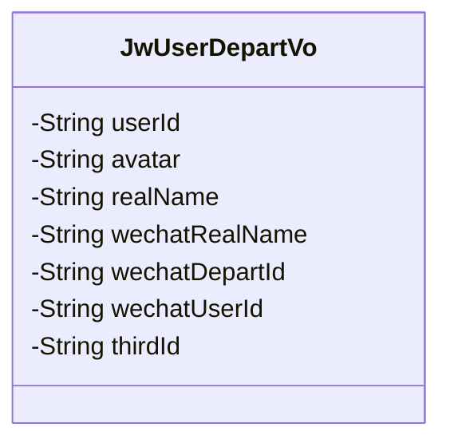
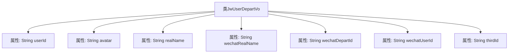

# 基础信息

|      |      |
|------|------|
| 名称 | JwUserDepartVo |
| 编码语言 | .java |
| 代码路径 | JeecgBoot/jeecg-boot/jeecg-module-system/jeecg-system-biz/src/main/java/org/jeecg/modules/system/vo/thirdapp/JwUserDepartVo.java |
| 包名 | org.jeecg.modules.system.vo.thirdapp |
| 依赖项 | ['lombok.Data'] |
| 概述说明 | JwUserDepartVo类含用户ID、头像、姓名及企业微信信息。 |

# 说明

JwUserDepartVo类是一个用于存储用户信息的类，其中包含用户ID、用户头像、用户真实姓名以及与企业微信相关的信息。这些字段共同构成了用户的基本资料，便于在系统中进行用户管理和信息展示。

# 类列表 Class Summary

| 名称   | 类型  | 说明 |
|-------|------|-------------|
| JwUserDepartVo | class | JwUserDepartVo类包含用户ID、头像、真实姓名及企业微信相关信息。 |

## 类 JwUserDepartVo

|      |      |
|------|------|
| 访问范围 | @Data;public |
| 类型 | class |
| 名称 | JwUserDepartVo |
| 说明 | JwUserDepartVo类包含用户ID、头像、真实姓名及企业微信相关信息。 |

### UML类图

这段代码定义了一个名为 `JwUserDepartVo` 的类，用于表示用户与部门的相关信息。类中包含多个私有属性，分别用于存储用户ID、用户头像、真实姓名、企业微信中的姓名、企业微信中的部门ID、企业微信中的用户ID以及第三方ID。这些属性通过 `@Data` 注解自动生成了相应的getter和setter方法，简化了代码的编写。该类主要用于在企业微信或类似系统中，管理用户与部门之间的关联信息。

### 内部方法调用关系图

这段代码定义了一个名为`JwUserDepartVo`的类，该类包含多个属性，分别用于存储用户ID、头像、真实姓名、企业微信的名字、企业微信对应的部门、企业微信对应的用户ID以及第三方ID。这些属性均为字符串类型，用于在系统中存储和传递用户及其相关企业微信信息。代码使用了`@Data`注解，可能来自Lombok库，用于自动生成getter、setter、toString等方法，简化代码编写。

### 字段列表 Field List

| 名称  | 类型  | 说明 |
|-------|-------|------|
| userId | String | 定义私有字符串变量userId。 |
| realName | String | 声明一个私有字符串变量realName。 |
| avatar | String | 定义私有字符串类型变量avatar。 |
| thirdId | String | 定义私有字符串变量thirdId。 |
| wechatRealName | String | 微信实名认证字段声明。 |
| wechatUserId | String | 定义了一个私有的微信用户ID字符串变量。 |
| wechatDepartId | String | 定义了一个私有字符串变量wechatDepartId。 |

### 方法列表 Method List

| 名称  | 类型  | 说明 |
|-------|-------|------|

