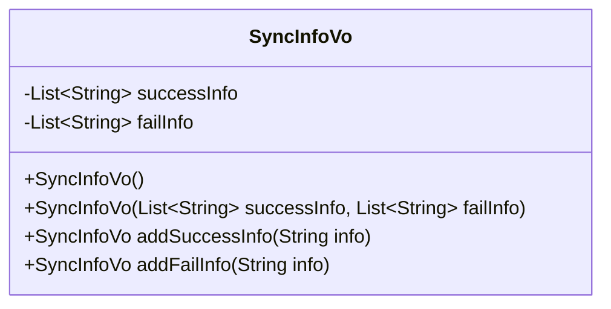
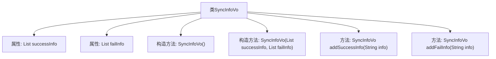

# 基础信息

|      |      |
|------|------|
| 名称 | SyncInfoVo |
| 编码语言 | .java |
| 代码路径 | JeecgBoot/jeecg-boot/jeecg-module-system/jeecg-system-biz/src/main/java/org/jeecg/modules/system/vo/thirdapp/SyncInfoVo.java |
| 包名 | org.jeecg.modules.system.vo.thirdapp |
| 依赖项 | ['lombok.Data', 'java.util.ArrayList', 'java.util.List'] |
| 概述说明 | SyncInfoVo类存储同步操作结果，支持添加和初始化。 |

# 说明

SyncInfoVo类设计用于记录同步操作的结果，包括成功和失败的详细信息。该类提供了添加和初始化功能，便于用户存储和管理同步操作的状态数据，确保操作结果的完整性和可追溯性。

# 类列表 Class Summary

| 名称   | 类型  | 说明 |
|-------|------|-------------|
| SyncInfoVo | class | SyncInfoVo类用于存储同步操作的成功和失败信息，支持添加和初始化。 |

## 类 SyncInfoVo

|      |      |
|------|------|
| 访问范围 | @Data;public |
| 类型 | class |
| 名称 | SyncInfoVo |
| 说明 | SyncInfoVo类用于存储同步操作的成功和失败信息，支持添加和初始化。 |

### UML类图

**描述：**  
`SyncInfoVo` 类用于管理同步操作的成功和失败信息。它包含两个私有成员变量 `successInfo` 和 `failInfo`，分别用于存储成功和失败的信息列表。类提供了两个构造函数，一个默认构造函数用于初始化空列表，另一个构造函数允许传入初始化的列表。此外，类还提供了 `addSuccessInfo` 和 `addFailInfo` 方法，用于向相应的列表中添加信息，并返回当前对象以支持链式调用。

### 内部方法调用关系图

这段代码定义了一个名为 `SyncInfoVo` 的类，用于存储同步操作的成功和失败信息。类中包含两个属性 `successInfo` 和 `failInfo`，分别用于存储成功和失败的信息列表。类提供了两个构造方法，一个无参构造方法用于初始化空列表，另一个构造方法允许直接传入成功和失败的信息列表。此外，类还提供了 `addSuccessInfo` 和 `addFailInfo` 方法，用于向相应的列表中添加信息，并返回当前对象以支持链式调用。

### 字段列表 Field List

| 名称  | 类型  | 说明 |
|-------|-------|------|
| failInfo | List<String> | 私有字符串列表存储失败信息。 |
| successInfo | List<String> | 成功信息列表存储为私有字符串列表。 |

### 方法列表 Method List

| 名称  | 类型  | 说明 |
|-------|-------|------|
| addFailInfo | SyncInfoVo | 方法`addFailInfo`将字符串`info`添加到`failInfo`集合并返回当前对象。 |
| addSuccessInfo | SyncInfoVo | 方法`addSuccessInfo`将`info`添加到`successInfo`并返回当前对象。 |

