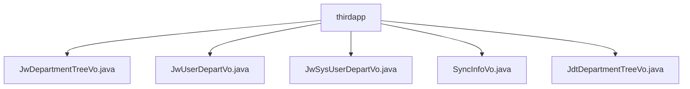

# 基础信息

|      |      |
|------|------|
| 名称 | thirdapp |
| 编码语言 | .java |
| 代码路径 | JeecgBoot/jeecg-boot/jeecg-module-system/jeecg-system-biz/src/main/java/org/jeecg/modules/system/vo/thirdapp |
| 包名 | JeecgBoot.jeecg-boot.jeecg-module-system.jeecg-system-biz.src.main.java.org.jeecg.modules.system.vo.thirdapp |
| 概述说明 | JwDepartmentTreeVo和JdtDepartmentTreeVo用于部门树结构管理，JwUserDepartVo存储用户信息，JwSysUserDepartVo管理用户映射关系，SyncInfoVo记录同步操作结果。 |

# 说明

## 概述

该代码模块主要围绕企业微信相关的部门管理、用户信息管理以及同步操作结果记录展开。模块中的类设计用于处理部门树结构、用户信息存储与映射、以及同步操作结果的记录与管理。通过这些类，模块能够高效地管理和展示部门层级关系、用户基本信息及其关联关系，并确保同步操作的可追溯性和完整性。

## 主要业务场景

1. **部门树结构管理**  
   - `JwDepartmentTreeVo` 和 `JdtDepartmentTreeVo` 类用于表示部门树结构，支持将部门数据转换为树形结构，并通过递归方法获取所有子节点。这些类适用于需要管理和展示部门层级关系的场景，如企业组织架构的展示与查询。

2. **用户信息管理**  
   - `JwUserDepartVo` 类用于存储用户的基本信息，包括用户ID、头像、真实姓名以及与企业微信相关的信息。适用于用户信息的管理与展示场景。
   - `JwSysUserDepartVo` 类用于管理用户列表及其之间的映射关系，适用于需要处理多用户关联的场景，如用户权限管理或用户分组。

3. **同步操作结果记录**  
   - `SyncInfoVo` 类用于记录同步操作的结果，包括成功和失败的详细信息。适用于需要跟踪和记录同步操作状态的场景，确保操作结果的完整性和可追溯性。

通过这些类，模块能够支持复杂的部门管理、用户信息管理以及同步操作的管理需求，适用于企业微信集成的相关业务场景。

### 包内部结构视图

该流程图展示了`thirdapp`目录下的文件层级关系。`thirdapp`作为根节点，包含了五个文件：`JwDepartmentTreeVo.java`、`JwUserDepartVo.java`、`JwSysUserDepartVo.java`、`SyncInfoVo.java`和`JdtDepartmentTreeVo.java`。每个文件都直接隶属于`thirdapp`目录，没有进一步的子目录结构。

# 文件列表 File List

| 名称   | 类型  | 说明 |
|-------|------|-------------|
| [JwUserDepartVo.java](JwUserDepartVo.md) | file | JwUserDepartVo类含用户ID、头像、姓名及企业微信信息。 |
| [JdtDepartmentTreeVo.java](JdtDepartmentTreeVo.md) | file | JdtDepartmentTreeVo类继承Department，含子部门列表及递归建树方法。 |
| [SyncInfoVo.java](SyncInfoVo.md) | file | SyncInfoVo类存储同步操作结果，支持添加和初始化。 |
| [JwSysUserDepartVo.java](JwSysUserDepartVo.md) | file | 企业微信用户映射类，包含用户列表及映射关系。 |
| [JwDepartmentTreeVo.java](JwDepartmentTreeVo.md) | file | JwDepartmentTreeVo继承Department，含子节点列表，支持树结构和递归获取子节点。 |

