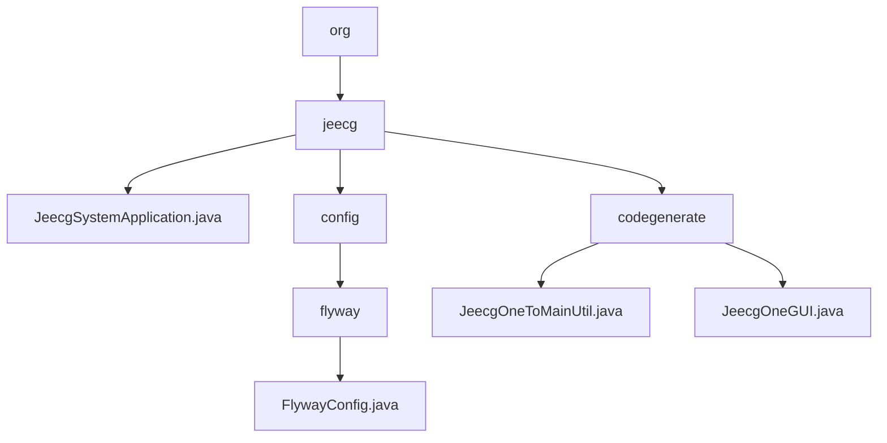

# 基础信息

|      |      |
|------|------|
| 名称 | org |
| 编码语言 | .java |
| 代码路径 | JeecgBoot/jeecg-boot/jeecg-module-system/jeecg-system-start/src/main/java/org |
| 包名 | JeecgBoot.jeecg-boot.jeecg-module-system.jeecg-system-start.src.main.java.org |
| 概述说明 | JeecgSystemApplication启动类配置Spring，禁用Elasticsearch健康检查，记录访问地址。Flyway配置类优化MySQL数据库迁移。代码生成模块简化数据模型开发，提升效率。 |

# 说明

## 概述  
该代码模块是一个综合性的开发工具集，旨在简化复杂数据模型的开发流程，并提供便捷的代码生成和编辑环境。模块的核心功能包括Spring应用的初始化与配置、MySQL数据库迁移管理、一对多数据模型的代码生成以及代码编辑窗口的启动。通过自动化代码生成和灵活的配置选项，该模块显著提升了开发效率，减少了重复性工作，并确保数据一致性和系统性能优化。

## 主要业务场景  
1. **Spring应用初始化与配置**：通过 `JeecgSystemApplication` 启动类，模块负责初始化Spring应用环境，禁用不必要的性能开销（如Elasticsearch的健康检查），并记录应用访问地址以便监控和管理，确保应用启动时正确加载所有配置。  
2. **MySQL数据库迁移管理**：模块中的Flyway配置类提供了灵活的数据库迁移管理功能，支持脚本路径、编码、前缀和后缀等参数的设置，确保数据库迁移过程的高效性和准确性。  
3. **一对多数据模型生成**：`JeecgOneToMainUtil` 工具用于自动生成一对多数据模型的代码文件，通过配置主表和子表的关系，确保数据一致性和完整性，减少手动编写的工作量。  
4. **代码编辑与调试**：`JeecgOneGUI` 类启动代码编辑窗口（`CodeWindow`），为开发者提供便捷的代码编写、查看和调试环境，进一步提升开发效率。  
5. **开发效率提升**：通过自动化代码生成、友好的代码编辑环境和灵活的配置选项，该模块显著减少了开发者的重复性工作，提升了整体开发效率。

### 包内部结构视图

该流程图展示了JeecgBoot项目中`jeecg-system-start`模块的Java文件结构。根节点为`org`，其下包含`jeecg`文件夹，`jeecg`文件夹中包含了`JeecgSystemApplication.java`文件以及`config`和`codegenerate`两个子文件夹。`config`文件夹下又包含`flyway`文件夹，`flyway`文件夹中有一个`FlywayConfig.java`文件。`codegenerate`文件夹下则包含`JeecgOneToMainUtil.java`和`JeecgOneGUI.java`两个文件。

# 文件列表 File List

| 名称   | 类型  | 说明 |
|-------|------|-------------|
| [jeecg](jeecg/_module.md) | package | JeecgSystemApplication启动类配置Spring，禁用Elasticsearch健康检查，记录访问地址。Flyway配置类优化MySQL数据库迁移。代码生成模块简化数据模型开发，提升效率。 |

