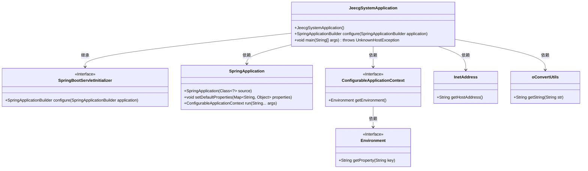
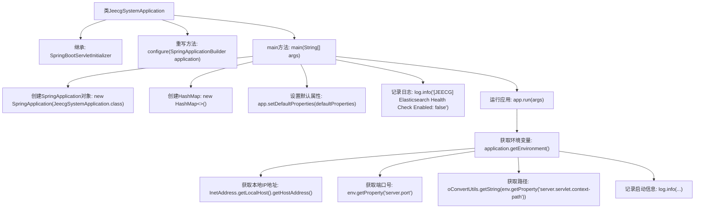

# 基础信息

|      |      |
|------|------|
| 名称 | JeecgSystemApplication |
| 编码语言 | .java |
| 代码路径 | JeecgBoot/jeecg-boot/jeecg-module-system/jeecg-system-start/src/main/java/org/jeecg/JeecgSystemApplication.java |
| 包名 | org.jeecg |
| 依赖项 | ['lombok.extern.slf4j.Slf4j', 'org.jeecg.common.util.oConvertUtils', 'org.springframework.boot.SpringApplication', 'org.springframework.boot.autoconfigure.SpringBootApplication', 'org.springframework.boot.builder.SpringApplicationBuilder', 'org.springframework.boot.web.servlet.support.SpringBootServletInitializer', 'org.springframework.context.ConfigurableApplicationContext', 'org.springframework.core.env.Environment', 'java.net.InetAddress', 'java.net.UnknownHostException', 'java.util.HashMap', 'java.util.Map'] |
| 概述说明 | JeecgSystemApplication启动类配置Spring，禁用Elasticsearch健康检查并记录访问地址。 |

# 说明

JeecgSystemApplication启动类负责配置Spring应用，主要功能包括初始化Spring环境，禁用Elasticsearch的健康检查以避免不必要的性能开销，同时记录应用的访问地址以便后续监控和管理。该启动类确保应用在启动时能够正确加载所有必要的配置，并优化系统性能。

# 类列表 Class Summary

| 名称   | 类型  | 说明 |
|-------|------|-------------|
| JeecgSystemApplication | class | JeecgSystemApplication启动类，配置Spring应用，禁用Elasticsearch健康检查，记录应用访问地址。 |

## 类 JeecgSystemApplication

|      |      |
|------|------|
| 访问范围 | @Slf4j;@SpringBootApplication;public |
| 类型 | class |
| 名称 | JeecgSystemApplication |
| 说明 | JeecgSystemApplication启动类，配置Spring应用，禁用Elasticsearch健康检查，记录应用访问地址。 |

### UML类图

这段代码是一个基于Spring Boot的应用程序启动类`JeecgSystemApplication`，它继承自`SpringBootServletInitializer`，并重写了`configure`方法以支持Servlet容器启动。`main`方法中，程序初始化了Spring应用，设置了默认属性，并启动了应用上下文。随后，程序获取了本地IP地址、服务器端口和上下文路径，并打印了应用的访问URL和Swagger文档地址。类图展示了`JeecgSystemApplication`与其他关键类之间的依赖关系，如`SpringApplication`、`ConfigurableApplicationContext`、`InetAddress`和`oConvertUtils`。

### 内部方法调用关系图

这段代码是一个Spring Boot应用的启动类`JeecgSystemApplication`，它继承了`SpringBootServletInitializer`并重写了`configure`方法。`main`方法中创建了`SpringApplication`对象，设置了默认属性，禁用了Elasticsearch的健康检查，并启动了应用。启动后，获取了环境变量、本地IP地址、端口号和路径，并记录了应用的启动信息，包括本地和外部访问URL以及Swagger文档的URL。

### 字段列表 Field List

| 名称  | 类型  | 说明 |
|-------|-------|------|

### 方法列表 Method List

| 名称  | 类型  | 说明 |
|-------|-------|------|
| configure | SpringApplicationBuilder | 重写SpringBoot配置，指定启动类为JeecgSystemApplication。 |
| main | void | 启动Jeecg-Boot应用，禁用Elasticsearch健康检查，记录本地和外部访问URL及Swagger文档地址。 |

