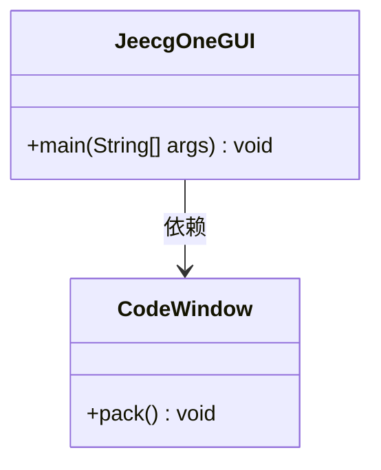
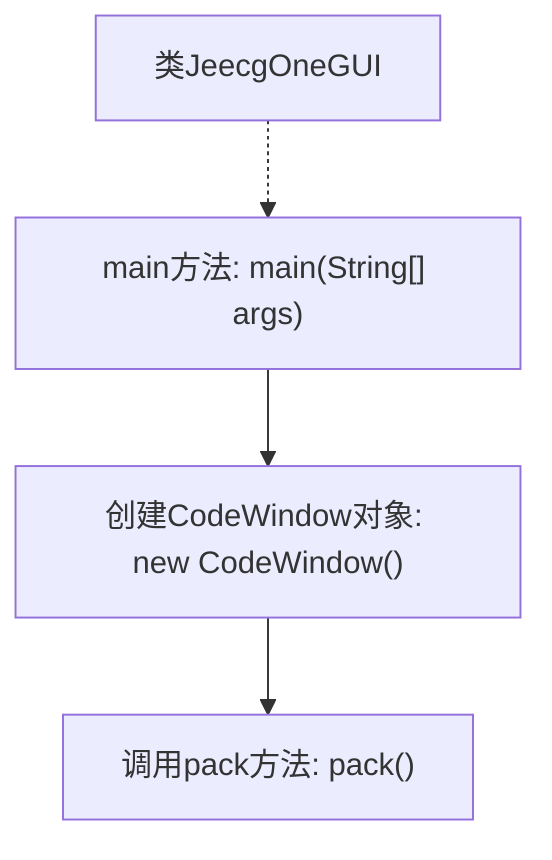

# 基础信息

|      |      |
|------|------|
| 名称 | JeecgOneGUI |
| 编码语言 | .java |
| 代码路径 | JeecgBoot/jeecg-boot/jeecg-module-system/jeecg-system-start/src/main/java/org/jeecg/codegenerate/JeecgOneGUI.java |
| 包名 | org.jeecg.codegenerate |
| 依赖项 | ['org.jeecgframework.codegenerate.window.CodeWindow'] |
| 概述说明 | JeecgOneGUI类启动CodeWindow窗口。 |

# 说明

JeecgOneGUI类负责启动CodeWindow窗口，主要用于代码编辑和查看功能。该类的核心任务是初始化并显示CodeWindow，确保用户能够便捷地进行代码编写和调试操作。通过JeecgOneGUI类，用户可以快速访问代码编辑环境，提升开发效率。

# 类列表 Class Summary

| 名称   | 类型  | 说明 |
|-------|------|-------------|
| JeecgOneGUI | class | JeecgOneGUI类启动CodeWindow窗口。 |

## 类 JeecgOneGUI

|      |      |
|------|------|
| 访问范围 | public |
| 类型 | class |
| 名称 | JeecgOneGUI |
| 说明 | JeecgOneGUI类启动CodeWindow窗口。 |

### UML类图

类图描述：`JeecgOneGUI` 类包含一个 `main` 方法，该方法通过创建 `CodeWindow` 类的实例并调用其 `pack` 方法来执行操作。`CodeWindow` 类负责窗口的打包和显示，`JeecgOneGUI` 类依赖于 `CodeWindow` 类来完成其功能。

### 内部方法调用关系图

这段代码定义了一个名为`JeecgOneGUI`的类，其中包含一个`main`方法。在`main`方法中，创建了一个`CodeWindow`对象，并调用了该对象的`pack`方法。`pack`方法通常用于调整窗口大小以适应其内容。整个流程展示了从程序启动到窗口初始化的简单过程。

### 字段列表 Field List

| 名称  | 类型  | 说明 |
|-------|-------|------|

### 方法列表 Method List

| 名称  | 类型  | 说明 |
|-------|-------|------|
| main | void | Java主方法启动CodeWindow并调整窗口大小。 |

