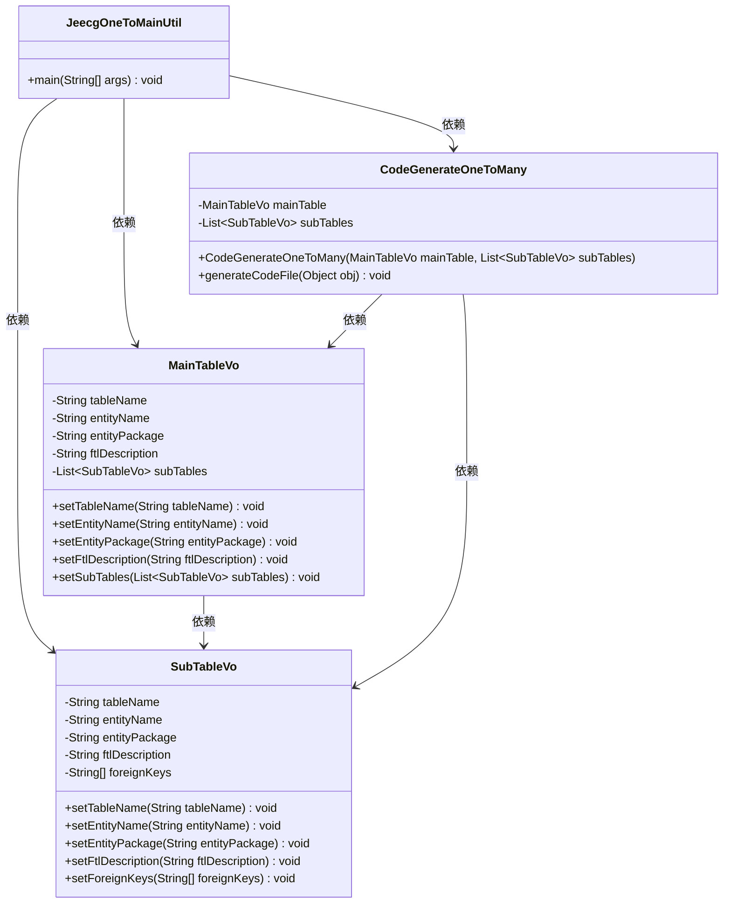
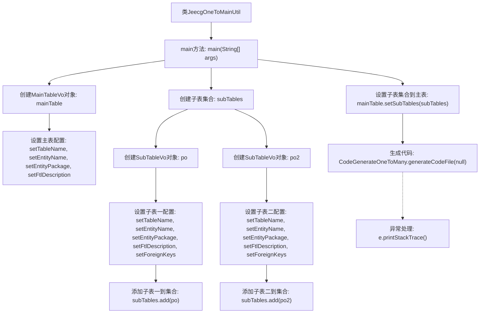

# 基础信息

|      |      |
|------|------|
| 名称 | JeecgOneToMainUtil |
| 编码语言 | .java |
| 代码路径 | JeecgBoot/jeecg-boot/jeecg-module-system/jeecg-system-start/src/main/java/org/jeecg/codegenerate/JeecgOneToMainUtil.java |
| 包名 | org.jeecg.codegenerate |
| 依赖项 | ['java.util.ArrayList', 'java.util.List', 'org.jeecgframework.codegenerate.generate.impl.CodeGenerateOneToMany', 'org.jeecgframework.codegenerate.generate.pojo.onetomany.MainTableVo', 'org.jeecgframework.codegenerate.generate.pojo.onetomany.SubTableVo'] |
| 概述说明 | JeecgOneToMainUtil用于创建一对多数据模型，配置主表子表并生成代码。 |

# 说明

JeecgOneToMainUtil工具用于生成一对多数据模型，通过配置主表和子表的关系，自动生成相应的代码文件。该工具简化了复杂数据模型的开发流程，提高了开发效率，确保了主表和子表之间的数据一致性和完整性。

# 类列表 Class Summary

| 名称   | 类型  | 说明 |
|-------|------|-------------|
| JeecgOneToMainUtil | class | JeecgOneToMainUtil生成一对多数据模型，配置主表和子表，生成代码文件。 |

## 类 JeecgOneToMainUtil

|      |      |
|------|------|
| 访问范围 | public |
| 类型 | class |
| 名称 | JeecgOneToMainUtil |
| 说明 | JeecgOneToMainUtil生成一对多数据模型，配置主表和子表，生成代码文件。 |

### UML类图

这段代码描述了一个用于生成一对多（父子表）数据模型的工具类 `JeecgOneToMainUtil`。`MainTableVo` 类表示主表配置，`SubTableVo` 类表示子表配置，`CodeGenerateOneToMany` 类负责根据主表和子表配置生成代码文件。`JeecgOneToMainUtil` 的 `main` 方法首先设置主表和子表的配置，然后调用 `CodeGenerateOneToMany` 的 `generateCodeFile` 方法生成代码文件。整个过程展示了主表与子表之间的依赖关系以及代码生成的过程。

### 内部方法调用关系图

这段代码的主要功能是生成一对多（父子表）数据模型的代码文件。首先，它创建并配置主表对象 `MainTableVo`，然后创建并配置两个子表对象 `SubTableVo`，并将它们添加到子表集合中。最后，通过 `CodeGenerateOneToMany` 类生成代码文件，并处理可能的异常。流程图清晰地展示了代码的执行流程和各个步骤之间的关系。

### 字段列表 Field List

| 名称  | 类型  | 说明 |
|-------|-------|------|

### 方法列表 Method List

| 名称  | 类型  | 说明 |
|-------|-------|------|
| main | void | 配置主表和子表并生成一对多数据模型代码。 |

