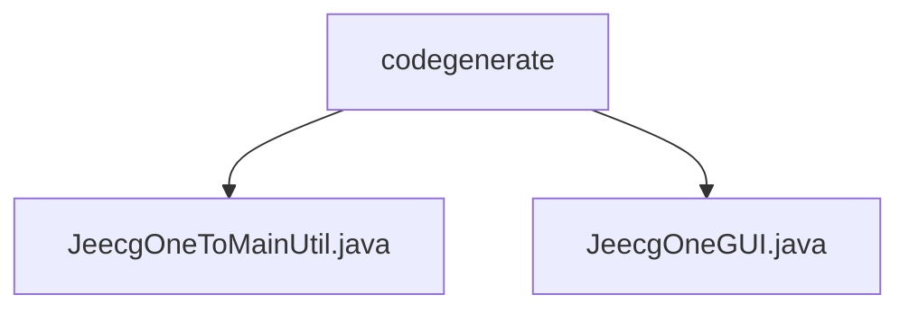

# 基础信息

|      |      |
|------|------|
| 名称 | codegenerate |
| 编码语言 | .java |
| 代码路径 | JeecgBoot/jeecg-boot/jeecg-module-system/jeecg-system-start/src/main/java/org/jeecg/codegenerate |
| 包名 | JeecgBoot.jeecg-boot.jeecg-module-system.jeecg-system-start.src.main.java.org.jeecg.codegenerate |
| 概述说明 | JeecgOneToMainUtil生成一对多模型代码，JeecgOneGUI启动代码编辑窗口，两者提升开发效率。 |

# 说明

## 概述  
该代码模块主要围绕代码生成和编辑功能展开，旨在简化复杂数据模型的开发流程，并提供便捷的代码编辑环境。模块中包含两个核心类：`JeecgOneToMainUtil` 和 `JeecgOneGUI`。`JeecgOneToMainUtil` 工具用于生成一对多数据模型，通过配置主表和子表的关系，自动生成相应的代码文件，确保数据一致性和完整性。`JeecgOneGUI` 类则负责启动代码编辑窗口（`CodeWindow`），为用户提供代码编写和调试的环境，提升开发效率。

## 主要业务场景  
1. **一对多数据模型生成**：通过 `JeecgOneToMainUtil` 工具，开发者可以快速生成复杂的一对多数据模型代码，减少手动编写的工作量，同时确保主表和子表之间的数据关系正确无误。  
2. **代码编辑与调试**：`JeecgOneGUI` 类为开发者提供了一个便捷的代码编辑窗口，支持代码编写、查看和调试操作，帮助开发者高效完成代码开发任务。  
3. **开发效率提升**：通过自动化代码生成和友好的代码编辑环境，该模块显著减少了开发者的重复性工作，提升了整体开发效率。

### 包内部结构视图

该流程图展示了`codegenerate`目录下的文件层级关系。`codegenerate`作为根节点，包含两个子节点：`JeecgOneToMainUtil.java`和`JeecgOneGUI.java`。这两个文件均位于`codegenerate`目录下，表示它们属于同一层级，且直接依赖于父目录。

# 文件列表 File List

| 名称   | 类型  | 说明 |
|-------|------|-------------|
| [JeecgOneGUI.java](JeecgOneGUI.md) | file | JeecgOneGUI类启动CodeWindow窗口。 |
| [JeecgOneToMainUtil.java](JeecgOneToMainUtil.md) | file | JeecgOneToMainUtil用于创建一对多数据模型，配置主表子表并生成代码。 |

