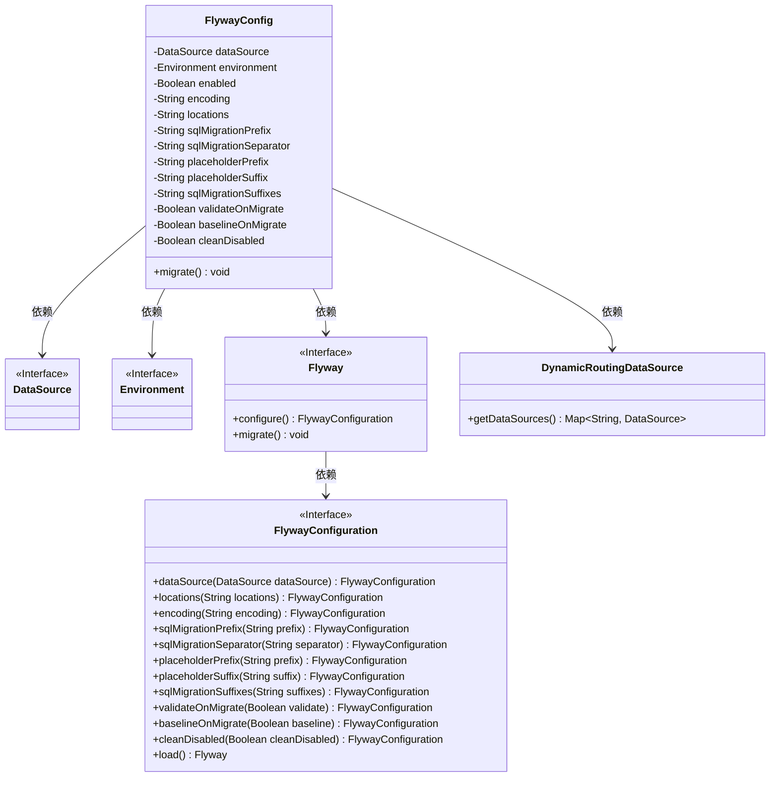
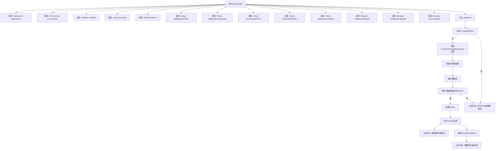

# 基础信息

|      |      |
|------|------|
| 名称 | FlywayConfig |
| 编码语言 | .java |
| 代码路径 | JeecgBoot/jeecg-boot/jeecg-module-system/jeecg-system-start/src/main/java/org/jeecg/config/flyway/FlywayConfig.java |
| 包名 | org.jeecg.config.flyway |
| 依赖项 | ['com.baomidou.dynamic.datasource.DynamicRoutingDataSource', 'lombok.extern.slf4j.Slf4j', 'org.flywaydb.core.Flyway', 'org.flywaydb.core.api.FlywayException', 'org.springframework.beans.factory.annotation.Autowired', 'org.springframework.beans.factory.annotation.Value', 'org.springframework.context.annotation.Bean', 'org.springframework.context.annotation.Configuration', 'org.springframework.core.env.Environment', 'javax.annotation.PostConstruct', 'javax.sql.DataSource', 'java.util.Map'] |
| 概述说明 | Flyway配置类支持MySQL数据库迁移，可设置脚本路径、编码、前缀、后缀等参数。 |

# 说明

Flyway配置类专为MySQL数据库迁移设计，提供多种参数设置功能，包括脚本路径、编码、前缀和后缀等。通过灵活配置这些参数，用户可以精确控制数据库迁移过程中的脚本加载和执行方式，确保迁移过程的高效性和准确性。

# 类列表 Class Summary

| 名称   | 类型  | 说明 |
|-------|------|-------------|
| FlywayConfig | class | Flyway配置类，用于MySQL数据库迁移，支持脚本路径、编码、前缀、后缀等参数设置。 |

## 类 FlywayConfig

|      |      |
|------|------|
| 访问范围 | @Slf4j;@Configuration;public |
| 类型 | class |
| 名称 | FlywayConfig |
| 说明 | Flyway配置类，用于MySQL数据库迁移，支持脚本路径、编码、前缀、后缀等参数设置。 |

### UML类图

**描述**：`FlywayConfig`类是一个Spring配置类，用于配置和管理数据库迁移工具Flyway。它依赖于`DataSource`、`Environment`和`DynamicRoutingDataSource`来获取数据源和环境配置。`FlywayConfig`类通过`migrate`方法执行数据库迁移，并根据配置参数初始化`Flyway`实例。`Flyway`接口提供了配置和迁移方法，而`FlywayConfiguration`接口用于配置Flyway的各种参数。

### 内部方法调用关系图

这段代码定义了一个`FlywayConfig`类，用于配置和执行Flyway数据库迁移。代码首先通过`@Value`注解从配置文件中读取相关属性，然后在`@PostConstruct`注解的`migrate`方法中，根据配置决定是否执行迁移。如果`enabled`为`true`，代码会遍历所有数据源，针对MySQL数据库配置并执行Flyway迁移，成功或失败时分别记录日志。对于非MySQL数据库，代码会记录警告日志。

### 字段列表 Field List

| 名称  | 类型  | 说明 |
|-------|-------|------|
| dataSource | DataSource | 自动注入数据源实例。 |
| environment | Environment | 自动注入环境变量配置。 |
| enabled | Boolean | Spring Flyway 启用状态默认为 false。 |
| cleanDisabled | Boolean | Spring配置中禁用了Flyway的清理功能。 |
| placeholderPrefix | String | Spring Flyway配置占位符前缀为`#(`。 |
| validateOnMigrate | Boolean | Spring Flyway配置：验证迁移时默认为真。 |
| sqlMigrationSuffixes | String | Spring配置中定义Flyway SQL迁移文件的后缀。 |
| encoding | String | Spring Flyway编码默认UTF-8，可通过配置修改。 |
| baselineOnMigrate | Boolean | Spring Flyway配置：baselineOnMigrate默认启用。 |
| locations | String | Spring配置中Flyway的SQL脚本路径默认为classpath:flyway/sql/mysql。 |
| placeholderSuffix | String | Spring配置中定义Flyway占位符后缀的变量。 |
| sqlMigrationPrefix | String | Spring Flyway SQL迁移前缀配置为"V"。 |
| sqlMigrationSeparator | String | Spring配置中定义SQL迁移文件分隔符为"__"。 |

### 方法列表 Method List

| 名称  | 类型  | 说明 |
|-------|-------|------|
| migrate | void | 代码实现MySQL数据库的Flyway自动升级，忽略其他类型数据库。 |

