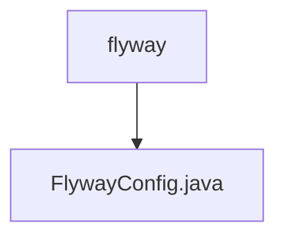

# 基础信息

|      |      |
|------|------|
| 名称 | flyway |
| 编码语言 | .java |
| 代码路径 | JeecgBoot/jeecg-boot/jeecg-module-system/jeecg-system-start/src/main/java/org/jeecg/config/flyway |
| 包名 | JeecgBoot.jeecg-boot.jeecg-module-system.jeecg-system-start.src.main.java.org.jeecg.config.flyway |
| 概述说明 | Flyway配置类支持MySQL数据库迁移，可设置脚本路径、编码、前缀、后缀等参数。 |

# 说明

Flyway配置类专为MySQL数据库迁移设计，提供多种参数设置功能，包括脚本路径、编码、前缀和后缀等。通过灵活配置这些参数，用户可以精确控制数据库迁移过程中的脚本加载和执行方式，确保迁移过程的高效性和准确性。

### 包内部结构视图

该流程图展示了路径中的层级关系，`flyway` 文件夹下包含一个文件 `FlywayConfig.java`。路径结构简洁明了，体现了文件与文件夹之间的从属关系。

# 文件列表 File List

| 名称   | 类型  | 说明 |
|-------|------|-------------|
| [FlywayConfig.java](FlywayConfig.md) | file | Flyway配置类支持MySQL数据库迁移，可设置脚本路径、编码、前缀、后缀等参数。 |

